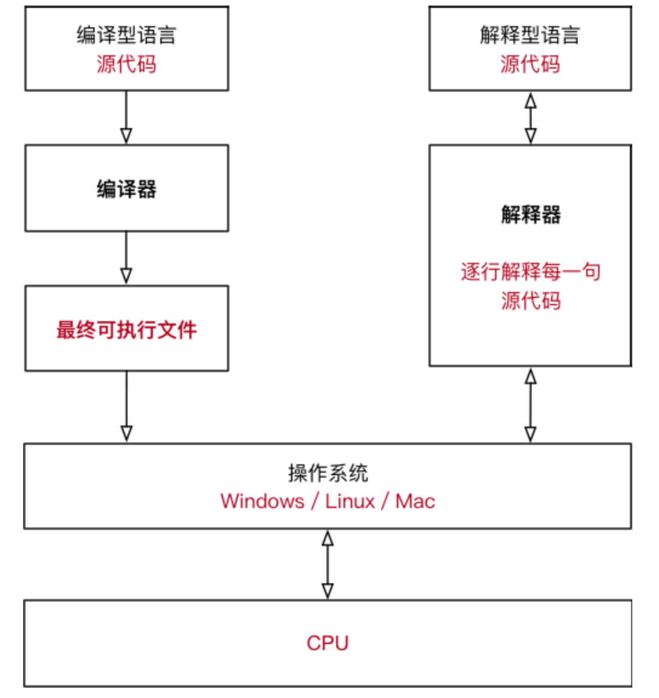

# 一、golang介绍

## 1. 语言介绍

Go 是一个开源的编程语言，它能让构造简单、可靠且高效的软件变得容易。

Go是从2007年末由Robert Griesemer, Rob Pike, Ken Thompson主持开发，后来还加入了Ian Lance Taylor, Russ Cox等人，**并最终于2009年11月开源，在2012年早些时候发布了Go 1稳定版本**。现在Go的开发已经是完全开放的，并且拥有一个活跃的社区。


Go 语言是谷歌为充分利用现代硬件性能又兼顾开发效率而设计的一种全新语言。

**Go 是一种跨平台（Mac OS、Windows、Linux 等）静态编译型语言**。拥有媲美 C 语言的强大性能，支持静态类型安全，在普通计算机上能几秒内快速编译一个大项目，开发效率跟动态语言相差无几。

Go 语言在国内拥有非常活跃的社区、不仅大公司的 Go 项目越来越多，中小公司也都在考虑 Go 的应用。当前 Go 语言主要应用于后端服务的开发，未来随着 Go 项目的完善，在系统、游戏、UI界面、AI、物联网等领域，都将被广泛使用。

当然 Go 语言有优点也有一些缺点，完美的东西毕竟太少，如果看好 Go 的未来发展，那么不如抛开成见先来体验一番。

## 2. 特性说明

**跨平台即最终可以执行到Windows，Linux，Unix等操作系统；**

**静态语言**：1）编译工具代码感知更友好；2）商业系统大型开发更有保障；3）静态语言相对封闭，第三方开发包侵害性小；

**动态语言**：1）代码编写更灵活；2）相对代码更简洁；

**编译型和非编译型语言**




Java 和 C# 比较特殊，源代码需要先转换成一种中间文件（字节码文件），然后再将中间文件拿到虚拟机中执行；


## 3. 核心开发团队

### Ken Thompson（肯·汤普森）


大名鼎鼎、如雷贯耳，Unix操作系统的发明人之一（排在第一号），C语言前身B语言的设计者，UTF-8编码设计者之一，图灵奖得主。老爷子今年快76岁了（1943年生）。早年一直在贝尔实验室做研究，60多岁的时候被谷歌尊养起来。2007年，老爷子和Rob Pike、Robert Griesemer一起设计了做出的Go语言。老爷子目前基本不参与Go的设计和开发。

在2011年的一次采访中，老爷子幽默地谈到设计Go语言的初衷是他们很不喜欢C++，因为C++中充满了大量的垃圾特性。

### Rob Pike（罗布·派克）


早年在贝尔实验室和Ken Thompson结对编程的小弟，早已成长为业内的领军人物。UTF-8两个发明人之一。Go设计团队第一任老大。如今也退休并被谷歌尊养起来了。Rob Pike仍旧活跃在各个Go论坛组中，适当地发表自己的意见。

顺便说一句，Go语言的地鼠吉祥物是由Rob Pike的媳妇Renee French设计的。

顺便另说一句，Rob Pike曾获得1980年奥运会射箭银牌。

### Robert Griesemer（罗伯特·格瑞史莫）


Go语言三名最初的设计者之一，比较年轻。曾参与V8 JavaScript引擎和Java HotSpot虚拟机的研发。目前主要维护Go白皮书和代码解析器等。

## 4. 开发的优秀项目

语言的目标是用于项目开发，并能打造出很多优秀的产品。那么，Golang有哪些好像优秀的项目呢？不搜不知道，一搜吓一跳！列举一下我收集到的golang开发的优秀项目，如下：

- docker，golang头号优秀项目，通过虚拟化技术实现的操作系统与应用的隔离，也称为容器；

- kubernetes，是来自 Google 云平台的开源容器集群管理系统。简称k8s，k8s和docker是当前容器化技术的重要基础设施；

- etcd，一种可靠的分布式KV存储系统，有点类似于zookeeper，可用于快速的云配置；

- codis，由国人开发提供的一套优秀的redis分布式解决方案；

- tidb，国内PingCAP 团队开发的一个分布式SQL 数据库，国内很多互联网公司在使用；

- influxdb，时序型DB，着力于高性能查询与存储时序型数据，常用于系统监控与金融领域；

## 5. 大厂都在用

1. 腾讯蓝鲸
2. 百度APP
3. 知乎python用go重构
4. 字节跳动：抖音
5. 七牛云

## 6 学习方法

- 多写多写再多写.........
- 实践：自己设计项目，工作中使用

# 二、安装部署

go官网： https://golang.google.cn/dl/ ，请选择自己对应的系统

中文社区：https://studygolang.com/dl

## 1. win环境

1. 下载go.{version}.windows-amd64.msi或者go.{version}.windows-amd64.zip包，此次使用go.{version}.windows-amd64.zip包
2. 解压压缩文件（这里使用的是D:\Project，后面都基于这个目录）
3. 配置环境变量GOPATH和GOROOT

```bash
# 打开cmd设置
set GOPATH=D:\Project\GOPATH
set GOROOT=D:\Project\GO
set PATH=%PATH%;%GOROOT%\bin
```

当然应该将这些环境变量配置到系统环境变量中

4. 此时打开cmd窗口，运行`go version`即可展示安装golang版本

```bash
> go version
go version go1.13.5 windows/amd64
```

## 2. linux环境

1. 下载linux版本对应安装包，这里使用 go{version}.linux-amd64.tar.gz
2. 进入linux对应目录，解压文件

```bash
tar -zxvf go{version}.linux-amd64.tar.gz
```

3. 设置环境变量GOPATH和GOROOT

```
# 临时修改
export GOPATH=D:\Project\GOPATH
export GOROOT=D:\Project\GO
export PATH=%PATH%:%GOROOT%\bin
```

修改全局环境变量

```bash
# 编辑全局环境变量文件
vi /etc/profile
# 追加环境变量都最后
export GOPATH=D:\Project\GOPATH
export GOROOT=D:\Project\GO
export PATH=%PATH%:%GOROOT%\bin
# 然后保存文件，并使文件生效
source /etc/profile
```

4. 运行`go version`查看版本信息

```bash
# go version
go version go1.13.5 windows/amd64
```

# 三、运行第一个程序

## 1. 运行和编译

当然还是hello word示例。创建文件hello.go，使用文本编辑器编辑，一定要注意文件编码为UTF-8

```go
package main

import "fmt"

func main() {
	fmt.Println("Hello World !")
}
```

保存文件后，运行

```bash
>go run hello.go
Hello World !
```

go编译运行

```bash
>go build hello.go

>hello.exe
hello world!
```

## 2. 交叉编译

交叉编译linux文件

```bash
set CGO_ENABLED=0
set GOOS=linux
set GOARCH=amd64
go build hello.go
```

交叉编译参数

```bash
$GOOS        $GOARCH
android     arm
darwin      386
darwin      amd64
darwin      arm
darwin      arm64
dragonfly   amd64
freebsd     386
freebsd     amd64
freebsd     arm
linux       386
linux       amd64
linux       arm
linux       arm64
linux       ppc64
linux       ppc64le
linux       mips
linux       mipsle
linux       mips64
linux       mips64le
netbsd      386
netbsd      amd64
netbsd      arm
openbsd     386
openbsd     amd64
openbsd     arm
plan9       386
plan9       amd64
solaris     amd64
windows     386
windows     amd64
```

