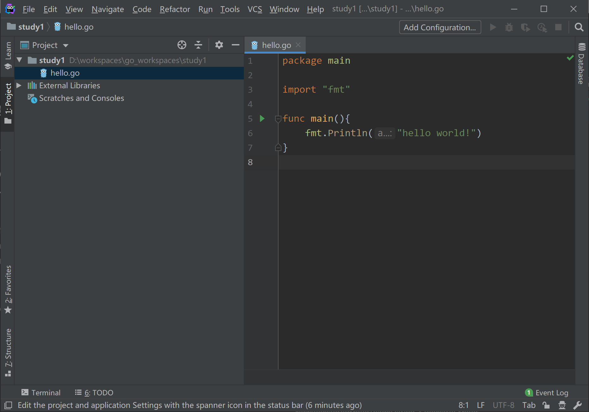
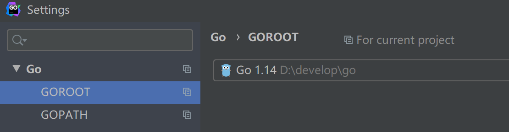
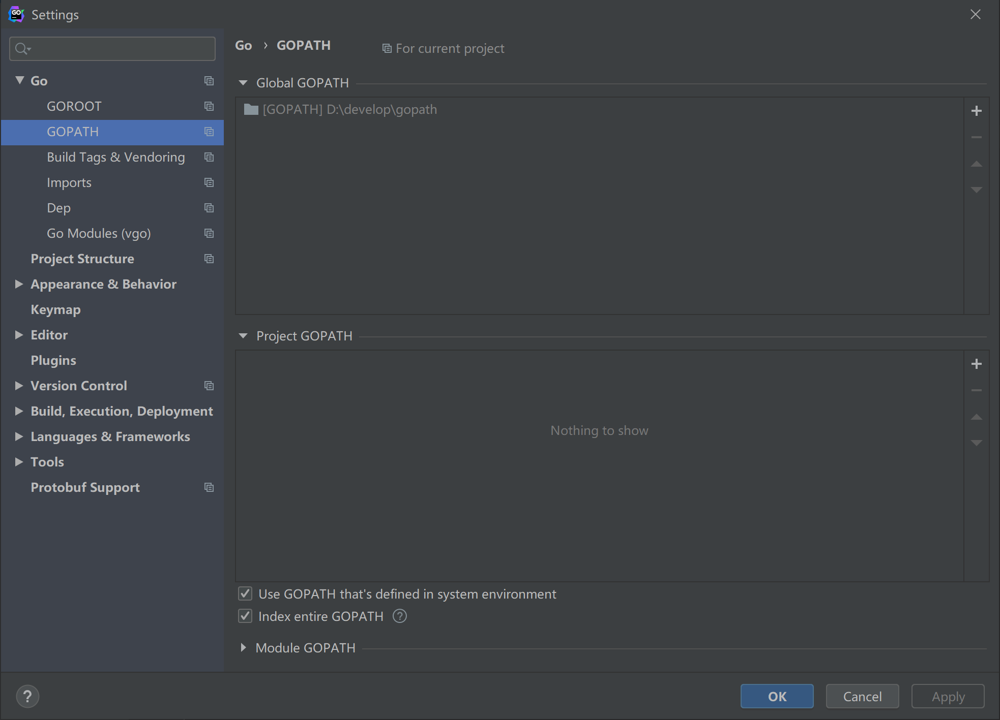
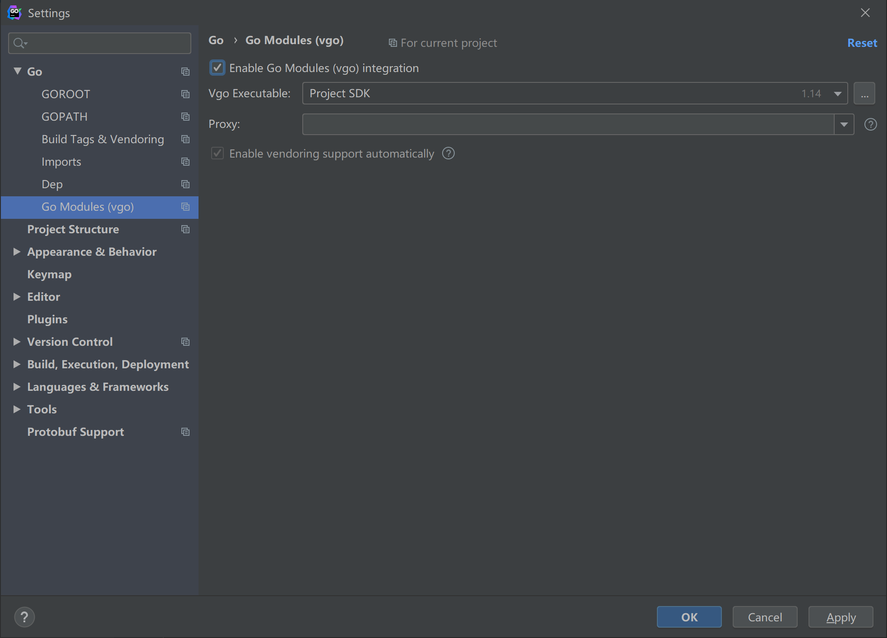
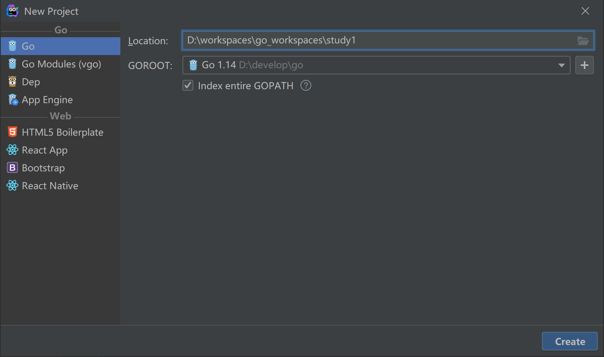
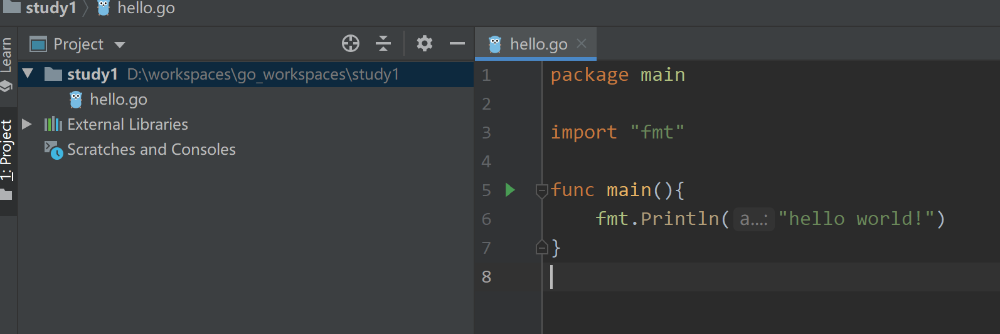
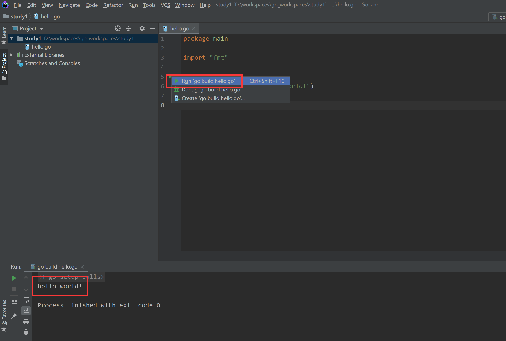
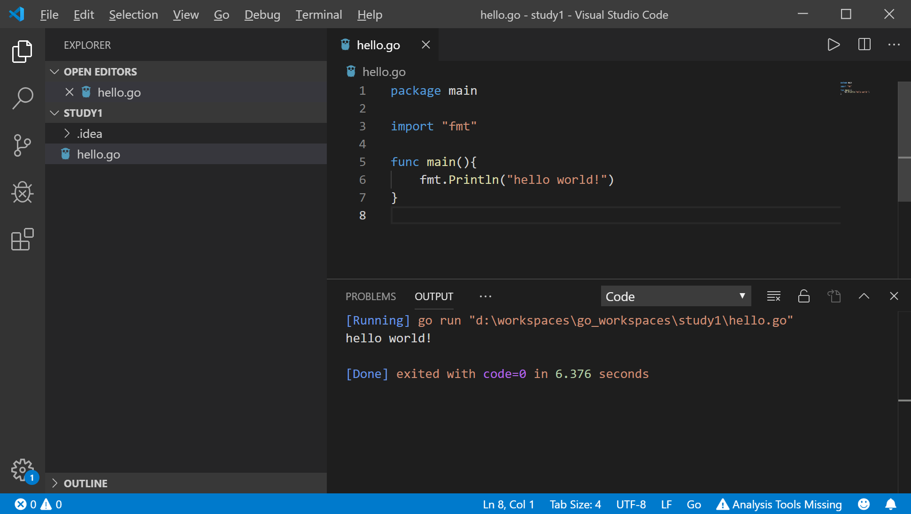

# 一、开发环境IDE安装

**工欲善其事，必先利其器**

这里推荐两款golang开发工具，一个是`goland`，一个是`VSCode`；goland是收费的，收费还是有收费的道理，确实比较好用，个人比较推荐；VSCode需要安装插件，免费版本，这个是前端开发的利器，go语言开发感觉还是差一点；

## 1. Goland

`JetBrains`的官方网站为：https://www.jetbrains.com/go/

`JetBrains`旗下的产品众多，最出名的就是IDEA，java开发工具；当然PHP，Python，Scala等开发语言，数据库版本都是有的；



1. 首先打开File->Setting或者Ctrl+Alt+S,设置goroot和gopath，默认会获取环境变量配置





2. 如果我们需要使用go modules功能，需要进行开启设置；



3. 最好我们编写helloworld运行

新建项目study1，选择目录



新建go文件


编写hello world

```go
package main

import "fmt"

func main(){
	fmt.Println("hello world!")
}
```



最后点击左侧启动运行，或者按Ctrl+Shift+F10运行程序



最终我们看到hello world运行成功！

## 2. vscode

VSCode的官网：https://code.visualstudio.com/

