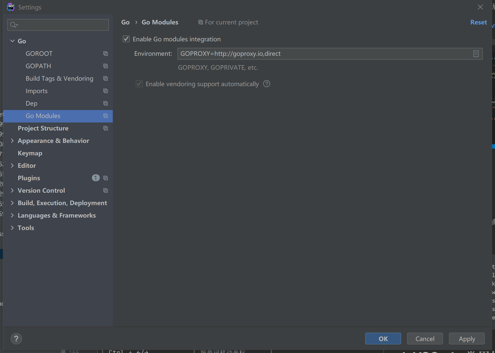

# 一、Go Modules

## 1. 介绍

Go modules是官方提供的go包管理工具，用于解决go包管理和依赖问题；从1.11开始引入，到现在1.14已经比较完善；类似于JS的NPM，Java的maven和gradle。

- GO111MODULE=off: 不使用 modules 功能。
- GO111MODULE=on: 使用 modules 功能，不会去 GOPATH 下面查找依赖包。
- GO111MODULE=auto: Golang 自己检测是不是使用 modules 功能。

## 2. 关于go.mod

`go.mod`是Go项目的依赖描述文件：

```go
module hello

go 1.14

require github.com/gogf/gf v1.15.3
```

1. module是配置项目名称

2. go配置的是使用的golang版本

3. require配置引用第三方依赖包路径和版本，latest表示最新版本；

配置完编译成功后，生成`go.sum`依赖分析结果，里面会有当前所有的依赖详细信息；

## 3. go modules指令

1. go get

   ```go
   go get -u (没有参数)下载、更新当前包下 直接和间接的依赖的最新版本，并不会更新整个项目。
   go get -u ./...下载、更新当前项目根目录下直接或间接的依赖的最新版本，但是会排除测试包的依赖；例如将v1.2.1更新为v2.0.1
   go get -u=patch ./...下载、更新当前项目根目录下直接或间接的依赖的大版本的最新小版本，例如，将v1.2.1更新为v1.2.5
   go get -u -t ./... 和go get -u ./...相似，但是会更新测试包的依赖
   go get -d 只执行下载动作，而不执行安装动作；不再支持go get -m ,使用go get -d替代。
   ```

2. go list

   ```go
   go list -m all 列出当前项目build时需要使用直接或间接依赖的版本。 (details)
   go list -u -m all 不仅会列出当前使用模块的版本，还会列出当前使用模块的最新小版本和最新版本。 (details)
   ```

3. go build ./... 构建当前项目 (details)

4. go test ./... 执行当前项目下的测试 (details)

5. go mod

```go
go mod tidy 删除不必要的依赖，添加OS, architecture, and build tags组合所需要的依赖。 (details)
go mod vendor 可选步骤，用于建立vendor文件夹，用于vendor机制的包管理(details)
go mod init 将go项目初始化成module-mode，使用go modules进行依赖管理。
go mod verify 校验go.sum记录的依赖信息是否正确
```

## 4. go modules需要注意的地方

- 在项目根目录下生成`go.mod`
- 项目中的包引用使用`import "[module名称]/[包所在文件在项目中的相对路径]"`

# 二、Goland配置

首先我们需要开启go modules功能，然后配置代理；不配置代理会访问国外地址，会很慢；建议使用以下三个地址：

- `https://goproxy.io`
- `https://goproxy.cn`
- `https://mirrors.aliyun.com/goproxy/`



项目结构：


使用上节课我们的hello world程序，创建`go.mod`,内容如下

```go
module hello

go 1.14

require (
github.com/gogf/gf v1.15.3
)
```

代码内容如下：

```go
package main

import (
	"fmt"
	"github.com/gogf/gf"
	"github.com/gogf/gf/crypto/gmd5"
)

func main(){
	fmt.Println("hello world!")
	fmt.Println(gf.VERSION)
	fmt.Println(gmd5.EncryptString("123456"))
}
```

第一次我们需要下载依赖包，可以选择go.mod文件右键选择`Go Mod Tidy`

或者点击没下载的包，`alt+enter`键，选择`Sync packages of hello`


然后运行程序看到运行结果

```go
hello world!
v1.15.3
e10adc3949ba59abbe56e057f20f883e <nil>

Process finished with exit code 0
```

